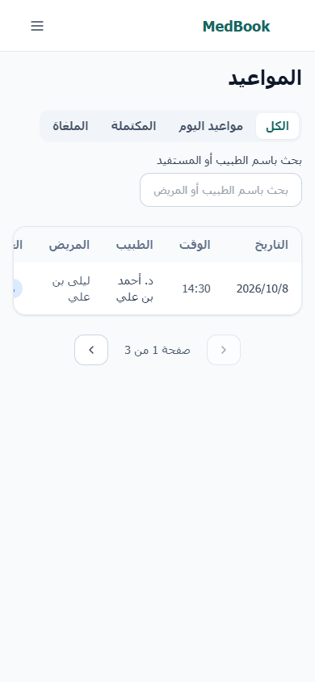
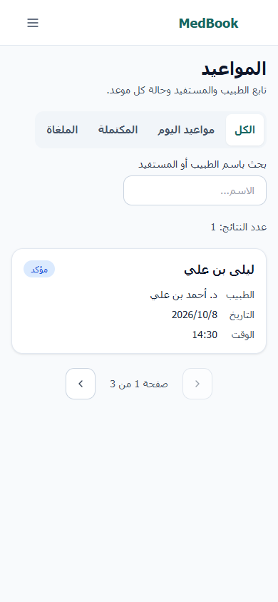
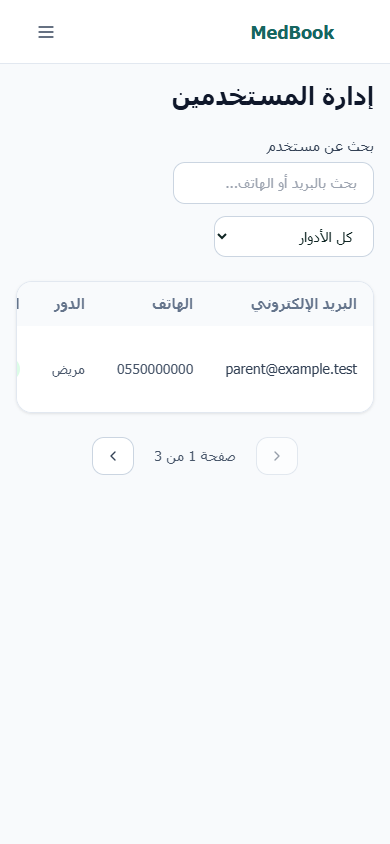
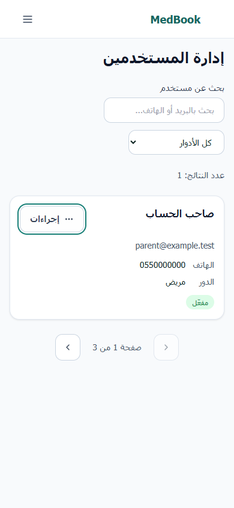
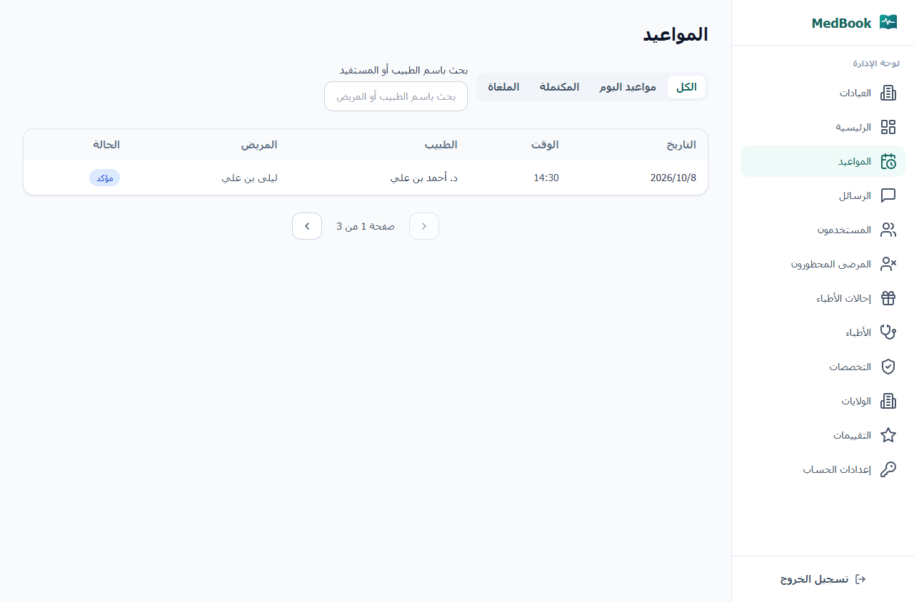
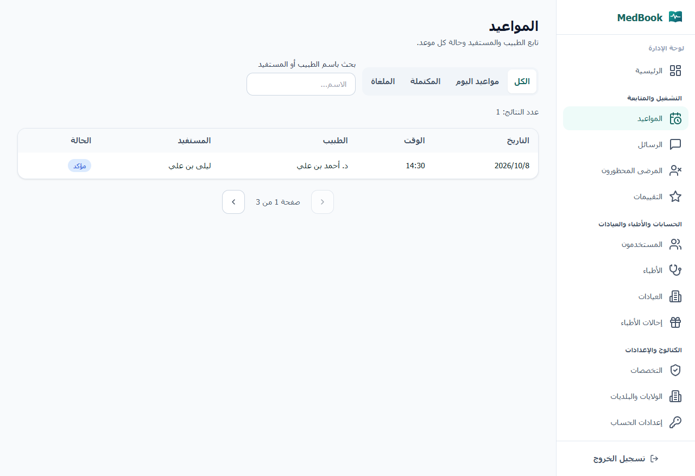
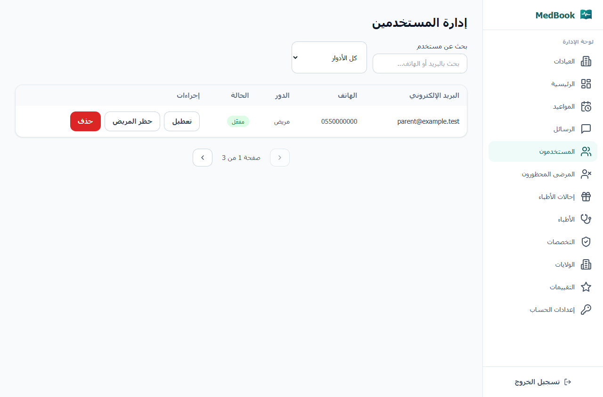
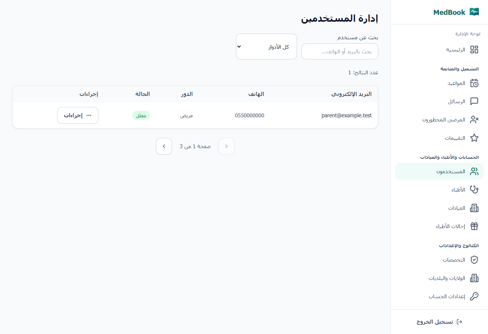

# المرحلة الثانية — توحيد إدارة MedBook

تستند إلى المرحلة الأولى المنشورة في PR #31 عند `f6bb7426cffe34a60a6c66d418e0377371e05ae0`. نُفذت في الفرع المعزول `fix/admin-phase2-20261008`، دون تعديل نسخة `current-release` ذات التغييرات السابقة. أجاز المستخدم النشر بعد نجاح الاختبارات.

وضعت الرئيسية أولًا وقسمت القائمة إلى التشغيل والمتابعة، الحسابات والأطباء والعيادات، والكتالوج والإعدادات؛ بقيت المسارات الاثنا عشر نفسها مع القسم الحالي واضحًا. قائمة الهاتف قابلة للتمرير وتغلق بالاختيار وEscape، وتعيد التركيز إلى زرها وتمنع تمرير الخلفية أثناء فتحها.

أصبحت المواعيد والحسابات بطاقات على الهاتف وجداول على الكمبيوتر. بطاقة الموعد تظهر المستفيد الفعلي، الطبيب، الحالة نصيًا، التاريخ والوقت، وتقدم فرد العائلة على صاحب الحساب. نقلت إجراءات الحسابات والتوثيق والاشتراك والانتقال والحذف إلى قوائم ثانوية تدعم Escape والنقر خارجها. حذوف البلديات موجودة داخل قائمة إجراءات الولاية مع اسم البلدية.

وحدت عدد النتائج، مسح الفلاتر، رسائل التحميل والفراغ والخطأ وإعادة المحاولة. تحفظ قوائم الحظر والإحالات فلاترها في URL، وتبقى مدخلات البحث ونموذج الإضافة عند الفشل. تظل الاستعلامات المتأخرة منفصلة عن البحث الأحدث. إشعارات الخطأ والنجاح لها دلالة وصول، وزر إغلاق مسمى وحجم ملائم للهاتف. لم تُضف خدمات أو أدوار أو صلاحيات كتابة جديدة.

الملفات المعنية: `frontend-doctor/src/App.tsx`، `components/layout/DashboardLayout.tsx`، `components/admin/AdminUI.tsx`، `components/ui/Toast.tsx`، `hooks/useAdminListParams.ts`، `index.css`، صفحات `pages/admin/` و`pages/AccountSettings.tsx`. التعديلات المشتركة في القائمة والإشعارات تحافظ على خيارات الطبيب والمساعد والعيادة الحالية.

نجح البناء وفحص الأنواع، ونجحت اختبارات الواجهة القائمة: 65/65. نجحت اختبارات المتصفح المعزولة: 17/17، دون أخطاء JavaScript؛ التفاصيل في [browser-results.json](browser-results.json). تشمل الأقسام الاثني عشر، عرض 360 و390 و768 و1280، الرجوع والتقدم وإعادة التحميل، مسح الفلاتر، البحث المتأخر، أخطاء ثمانية أقسام وإعادة المحاولة، فشل حفظ نموذج مع بقاء نصوصه، القوائم الثانوية، هوية المستلم ومسودات المحادثات. جميع طلبات API استُبدلت ببيانات وهمية داخل المتصفح؛ الاتصالات الخارجية محظورة. طلب POST الوحيد محاكاة فاشلة لإضافة تخصص.

مصفوفة الأفعال الكاملة في [action-matrix.csv](action-matrix.csv)، مع بيان ما أُعيد اختباره وما بقي من اختبارات المرحلة الأولى أو مراجعة المصدر. فتح القوائم والنماذج لا يثبت نجاح عمليات حذف أو تعديل حقيقية. لم تُختبر عمليات إدارة الإنتاج الكتابية، ولا قارئ شاشة فعلي أو لوحة مفاتيح هاتف فعلية. اختبار تقليص الارتفاع إلى 400 بكسل يثبت الوصول لأزرار النموذج عند ضيق العرض فقط.

الخادم والمخطط وواجهة المرضى لم تتغير في هذه المرحلة. المحافظة على المواعيد والطابور والأدوار والملفات والاشتراكات مستندة إلى نطاق الفرق واختبارات الواجهة، مع إثبات عرض `familyMemberId` واسم فرد العائلة. لم تُلتقط نسخة من صفوف الإنتاج قبل/بعد، فلا تدعي هذه المراجعة مقارنة قواعد بيانات الإنتاج.

المعاينة: http://127.0.0.1:5190/login، بحساب وهمي `admin@example.test` وكلمة `demo-only-1234`، باستخدام API معزول على 4181. لمراجعة ما قبل التعديل استخدمت المعاينة 5188 مع البيانات الوهمية نفسها.

صور الهاتف قبل وبعد:

صور الكمبيوتر قبل وبعد:

تحسينات تفاصيل الأقسام وقواعد التأكيد والتحقق الخلفي والكتالوج تتبع المرحلة الثالثة؛ لا يشمل هذا التغيير تعديل أسعار أو سياسة حظر أو مكافآت أو بيانات اعتماد.
