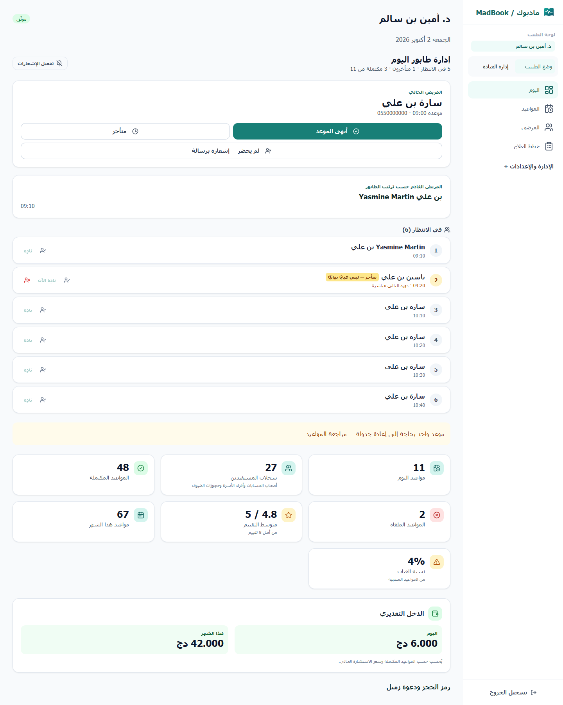
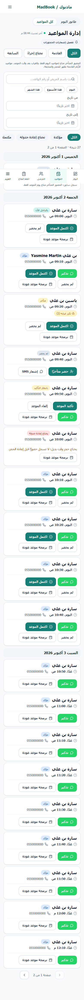
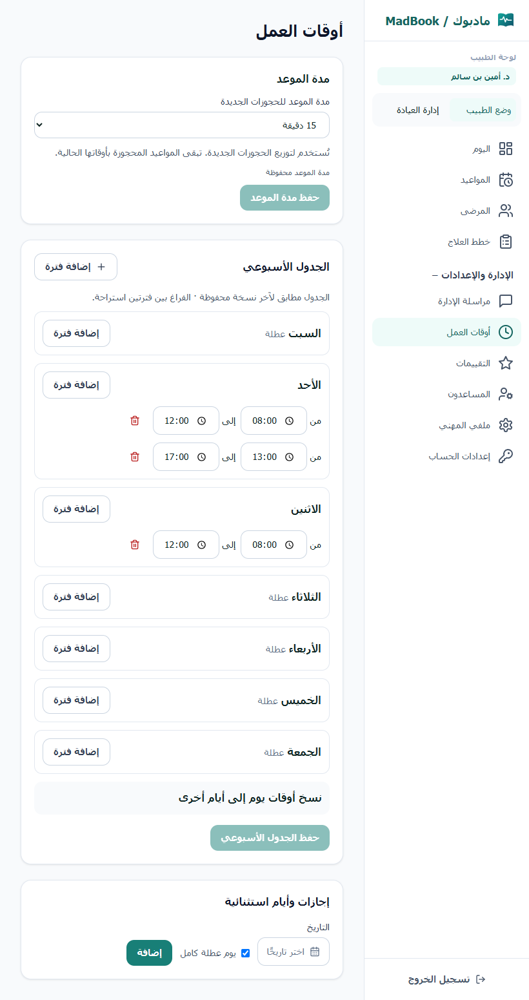

# مراجعة واجهة الطبيب — 2 أكتوبر 2026

## النطاق والتشخيص

المشروع الفعلي هو `current-release`، وواجهة الطبيب في `frontend-doctor`، وليست صفحات الطبيب القديمة في `frontend`. المسارات: `/`، `/appointments`، `/patients`، `/schedule`، و`/treatment-plans` لأطباء الأسنان فقط. صلاحيات المساعد وصاحب العيادة لم تتغير.

أخطاء مؤكدة من الكود:

- عدّ لوحة اليوم استخدم `patientId` وحده للحسابات و`guestPhone` للضيوف، بينما قائمة المرضى ميزت أفراد الأسرة. لذلك كان تعريف العدد مختلفًا بين الصفحتين. لم نفحص بيانات الإنتاج لإثبات العددين 118 و119 حرفيًا.
- شارات الغياب كانت مشتركة بين أفراد الأسرة، وتجمع الضيوف بالهاتف، وتستعمل غيابهم لدى أطباء آخرين. أصبحت تخص المستفيد المسجل عند الطبيب الحالي فقط. الضيف ليس له عدد غياب مثبت بالهوية.
- زر حضور المتأخر ظهر لكل `NO_SHOW` ولو كان يومه سابقًا. الخادم كان يرفض أصلًا إدخال موعد من يوم سابق؛ الواجهة الآن تحترم قيده اليومي.
- الخادم لم يرفض الفترات الأسبوعية المتداخلة أو المعكوسة. أضيف تحقق قبل القراءة أو الكتابة.

تحسينات الاستخدام: إبراز عمل اليوم، تقسيم سجل المواعيد وتجميعه، الجدول على الكمبيوتر، بطاقات الهاتف، إعادة موضع القائمة عند الرجوع، التنقل اليومي، والجدول الأسبوعي.

## تعريف العدد والهوية

يستخدم العدّ والقائمة الدالة نفسها `patientKey`: صاحب الحساب وفرد الأسرة لكل منهما هوية مسجلة مستقلة. حجز الضيف سجل حجز غير مثبت الهوية، يعرض منفردًا عبر معرّف الموعد. لا نستنتج تكرار الشخص من هاتف أو اسم؛ لذلك التسمية هي «سجلات المستفيدين» وليست عدد أشخاص مؤكّدًا. لم تُدمج أو تُفصل أي سجلات في قاعدة البيانات. قد يرتفع العدد المعروض للضيوف بعد إزالة التجميع بالهاتف، وهو تغيير لتعريف العرض فقط.

## التغييرات

- لوحة اليوم تستخدم `DoctorQueue` نفسه للإجراءات والمريض الحالي والقادم والمنتظرين والمتأخرين والمكتمل اليوم. الإحصاءات والدخل والتقييمات أسفل العمل اليومي. فشل الإحصاءات لا يحجب الطابور، والبيانات السابقة تبقى مع رسالة عند فشل تحديثها.
- سجل المواعيد: الكل، القادمة، السابقة، تحتاج إجراءً. لا تُخفى الفلاتر الصريحة القادمة من بطاقات الإحصاءات. بحث الاسم والهاتف والتاريخ والحالة محفوظ في الرابط، وكذلك القسم والصفحة. 20 نتيجة في الصفحة مع العدد، وتجميع حسب يوم الموعد، وجدول للكمبيوتر وبطاقات للأجهزة الأصغر.
- الإجراءات تستخدم مسارات الحالة الحالية: تأكيد/إلغاء المعلق، إنهاء الاستشارة حسب الدور والتوقيت، تسجيل الغياب، والحضور المتأخر في اليوم نفسه فقط. الإجراءات معطلة أثناء التنفيذ. لا مسار جديد لتصحيح غياب تاريخي.
- اليوم والمواعيد والمرضى وخطط العلاج المؤهلة في التنقل الأساسي. الإدارة والإعدادات قابلة للطي على الكمبيوتر والهاتف، مع توضيح حساب الطبيب وإدارة العيادة. بداية الأقسام من الأعلى، والرجوع يعيد الفلاتر وموضع القائمة. قائمة الهاتف تعمل بلوحة المفاتيح وتغلق بـEscape؛ المحتوى الخلفي غير قابل للتركيز أثناء فتحها. أضيف رابط تجاوز إلى المحتوى.
- الجدول الأسبوعي حسب الأيام، وأيام العطلة ظاهرة. نسخ الفترات إلى أيام مختارة يعدل المسودة فقط، مع توضيح أنه يستبدل أوقاتها. الفترات المتعددة تسمح باستراحة بينها. تغييرات الوقت لا تعيد ترتيب الحقول أثناء الكتابة. تظهر حالة حفظ الجدول ومدة الموعد، وتُرفض الأوقات غير الصالحة والتداخل قبل الحفظ. مدة الموعد تخص الحجوزات الجديدة؛ لم يتغير منطق أوقات الحجوزات القائمة.
- اسم المستفيد يستخدم عزل اتجاه النص، والهواتف والأوقات تحتفظ بعرض LTR. مكونات الأزرار والحقول والبطاقات الحالية وألوان الهوية محفوظة.

## الملفات

الخادم:

- `backend/src/lib/doctorPatients.ts`
- `backend/src/lib/scheduleValidation.ts` (جديد)
- `backend/src/modules/doctors/doctorSelf.service.ts`
- `backend/src/modules/appointments/appointments.service.ts`
- `backend/tests/doctorUiFixes.test.ts`
- `backend/tests/doctorIdentity.service.test.ts` (جديد)

الواجهة:

- `frontend-doctor/src/App.tsx`
- `frontend-doctor/src/components/layout/DashboardLayout.tsx`
- `frontend-doctor/src/lib/doctorUi.ts`
- `frontend-doctor/src/pages/doctor/DoctorDashboard.tsx`
- `frontend-doctor/src/pages/doctor/DoctorQueue.tsx`
- `frontend-doctor/src/pages/doctor/DoctorAppointments.tsx`
- `frontend-doctor/src/pages/doctor/DoctorPatients.tsx`
- `frontend-doctor/src/pages/doctor/DoctorSchedule.tsx`
- `frontend-doctor/tests/doctorUi.test.ts`

## الاختبارات والأدلة

- TypeScript وبناء الخادم: ناجح.
- بناء واجهة الطبيب: ناجح. تنبيه Vite بشأن حجم الحزمة أكبر من 500 kB قائم؛ لم نضف مكتبات.
- اختبارات واجهة الطبيب: 20 ناجحًا.
- اختبارات الخادم المحلية: 432 ناجحًا، صفر فشل، 187 اختبار تكامل متجاوز لعدم ضبط قاعدة الاختبار. تقرير `backend-tests.json`.
- الاختبارات الجديدة تتحقق من تطابق عدد لوحة اليوم والقائمة، وعدم نقل غياب فرد أسرة إلى آخر، وعدم تجميع الضيوف بالهاتف، وحذف حقول المساعد المحظورة، ورفض الجدول قبل الاتصال بقاعدة البيانات.
- فحص Chrome محلي، بيانات وهمية فقط، واعتراض **كل** طلب API ومنع الطلبات الخارجية. أربعة أقسام بعروض 390×844، 820×1100، 1440×1000؛ لا تجاوز أفقي ولا أخطاء JavaScript. 23 فحصًا تشمل الحالة الفارغة والخطأ، النسخ والحفظ، حفظ الفلاتر والموضع عند الرجوع، بداية الأقسام من الأعلى، القائمة بلوحة المفاتيح، ونقرة مزدوجة لا ترسل إلا تحديثًا واحدًا. النتائج في `visual-results.json` والبرنامج في `visual-qa.cjs`.
- اختبارات السباق الفعلية وقيود `IN_PROGRESS` على PostgreSQL تُفحص في CI بقاعدة مؤقتة قبل النشر. لم يتغير `lockDoctorCalls` أو منطق معاملات الطابور.

الصور كلها بيانات تجريبية:

## الحدود وما لم يُحسم

- لا يمكن إثبات أن حجوزات دون حساب تخص الشخص نفسه دون هوية مستقرة ومراجعة بشرية. لا مطابقة أسماء أو هواتف ولا إصلاح بيانات تلقائي.
- موعد العودة للضيف غير مدعوم من الخادم الحالي؛ يعرض سبب عدم الإتاحة بوضوح. حساب لديه مواعيد ملغاة فقط يعرض سببًا مختلفًا: لا موعد أصل صالح.
- تصحيح `NO_SHOW` التاريخي يحتاج مسار تصحيح محفوظ الأثر والصلاحيات، وليس إدخالًا إلى طابور اليوم. لم نضف مسارًا جانبيًا لهذه المهمة.
- اختبار لوحة المفاتيح يغطي التركيز والتنقل والقائمة؛ لم يُجر تدقيق كامل بقارئ شاشة أو جهاز هاتف فعلي.
- لا تغييرات Prisma أو migration، ولا تعديل بيانات إنتاج أو إرسال إشعارات فعلية أثناء الفحص. التعديلات السابقة غير المرتبطة بواجهة الطبيب مستثناة من الإصدار.

## الرجوع

يمكن الرجوع بإلغاء commit هذا الإصدار وإعادة نشر النسخة السابقة. لا تغيير بيانات أو schema يحتاج migration عكسية. تعريف عرض السجلات وشارات الغياب سيعود إلى القواعد السابقة عند الرجوع.

تفاصيل الإصدار والتحقق بعد النشر في `RELEASE.md` عند اكتماله.
